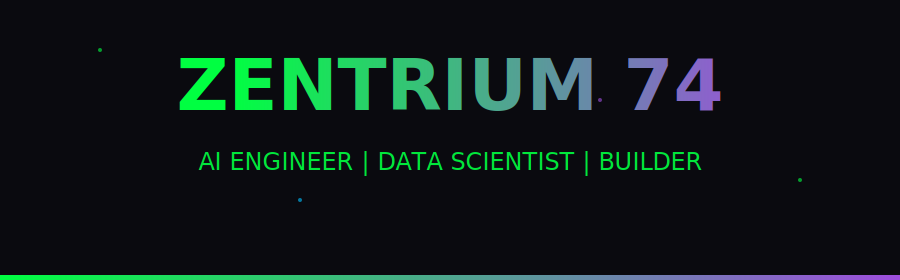

  

 

## 🧠 About Me

Hi, I'm **Sid** — an AI Engineer & Data Scientist passionate about building intelligent systems, generative AI applications, and automation tools. I work across the full stack of AI — from data pipelines to LLM deployment.
- 📫 Reach me at **[Sidharthay74@Gmail.com]**

---

## 🚀 Tech Stack

### **Languages**

### **AI/ML/NLP**

### **AI Productivity Tools**

### **LLM & Agentic AI**

### **Cloud Platforms**

## 🗂️ Projects

> All code is private — but here's what I've built:

---

### 🧠 Social Memory
`AI · LLM · Memory Management`

An AI-powered personal memory and context management system. Helps users store, retrieve, and interact with their own knowledge using LLMs.

---

### 🤝 Conncetme
`TypeScript · Networking · Web App`

A professional networking and connection-building platform designed to simplify meaningful human connections in the digital space.

---

### 🤖 AI DATA Interview Prep
`Python · Generative AI · Career Tools`

An AI-powered interview preparation guide tailored for data science and AI roles — covering Basics, technical questions. Works for me for quick Recap.

---

### 🎯 FocusMode
`TypeScript · Productivity · Web App`

A productivity web application designed to help users eliminate distractions and maintain deep work sessions with structured focus timers.

---

### 🤖 RAG-BOOM
`Python · RAG · Generative AI`

A high-performance Retrieval-Augmented Generation (RAG) pipeline that grounds LLM responses in your own documents and knowledge bases.

---

### 💬 RAG Chatbot Web
`TypeScript · RAG · Web App`

A full-stack web chatbot powered by RAG — enabling users to ask questions over custom document collections in a clean chat interface.

---

### 🛡️ Interview Guard for HR
`TypeScript · AI · HR Tech`

An AI tool for HR professionals to detect inconsistencies in candidate responses and assist in structured, bias-reduced interview evaluation.

---

### ⏰ Motel Time Manager
`TypeScript · Scheduling · Operations`

A scheduling and time management tool built for motel operations — tracking staff shifts, room assignments, and daily operational timelines.

---

### 🤖 n8n Job Application Automation
`n8n · Automation · AI Agents`

An intelligent job application automation workflow built in n8n — streamlining resume submission, follow-ups, and application tracking at scale.

---
---

### 📊 ML Model Performance Dashboard
`TypeScript · Machine Learning · Analytics`

An interactive dashboard to monitor, compare, and visualize machine learning model performance metrics across experiments.

---

### 📈 Time Series Analysis & Forecasting
`Python · Data Science · Forecasting`

End-to-end time series analysis and forecasting project covering EDA, feature engineering, and predictive modeling on real-world datasets.

